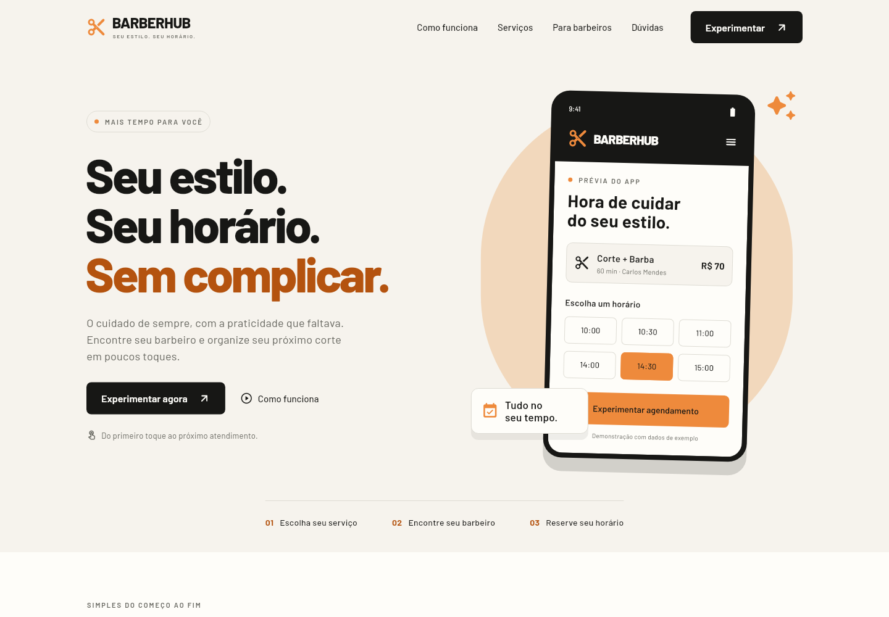
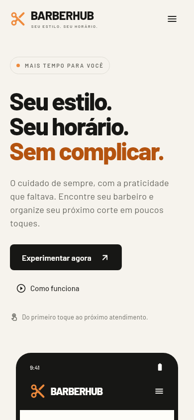

# BarberHub Web

Landing page responsiva, feita em **Flutter Web**, para apresentar o [BarberHub](https://github.com/Guizeraaaa/BarberHub/tree/develop).

## Executar

Pré-requisitos: Flutter estável com Dart **3.12.2 ou superior** e Chrome. A interface usa componentes do Flutter; o pacote oficial `cupertino_icons` fornece os ícones dos controles adaptativos do iOS.

Ambiente de validação e CI: Flutter **3.47.6**, Dart **3.13.5**.

```bash
git clone https://github.com/Guizeraaaa/BarberHubWeb.git
cd BarberHubWeb
flutter pub get
flutter run -d chrome
```

Se as alterações ainda estiverem no pull request, faça `git switch feature/flutter-web-landing` antes de executar.

## Gerar a versão para publicação

```bash
flutter build web --release --no-web-resources-cdn
```

O resultado fica em `build/web/`. Publique **todo o conteúdo** desse diretório em um servidor estático com HTTPS. Para hospedar em um subdiretório, use, por exemplo:

```bash
flutter build web --release --no-web-resources-cdn --base-href /BarberHubWeb/
```

Para testar o build local, sem abrir diretamente o arquivo HTML:

```bash
python -m http.server 8080 --directory build/web
```

Acesse `http://localhost:8080`. O build inclui o CanvasKit localmente e a fonte Barlow está empacotada, sem depender de um CDN de fontes.

## O que está implementado

- Identidade do app original: laranja `#EE8A3C`, preto, fonte Barlow e símbolo de tesoura.
- Layout para celular, tablet e computador, com menu compacto nos tamanhos menores.
- Navegação por seções com rolagem suave e respeito à preferência de reduzir animações.
- Apresentação do fluxo, catálogo de serviços, prévia do painel do barbeiro e perguntas frequentes.
- Demonstração interativa de agendamento: serviço, profissional, data, horário e resumo.
- Seleção de profissionais compatíveis com o serviço. Diego Almeida não aparece na opção de barba, conforme o catálogo de referência.
- Abertura do repositório original em outra aba, com `noopener,noreferrer`.
- Fonte e ícones locais, metadados da página, estados de carregamento e build sem recursos de CDN.
- Testes de layout, navegação e comportamento da demonstração.

**A demonstração não faz reservas reais.** Não há backend, login, envio de dados, pagamento ou persistência. Valores, horários e indicadores são exemplos, identificados na página. A integração com o app e com um backend fica para uma próxima etapa.

## Organização

| Pasta/arquivo | Responsabilidade |
| --- | --- |
| `lib/main.dart` | Inicialização da aplicação |
| `lib/features/landing/pages/` | Página e navegação por seções |
| `lib/features/landing/widgets/` | Hero, serviços, prévias e demonstração |
| `lib/features/landing/models/` | Catálogo de exemplo |
| `lib/features/landing/theme/` | Cores, tipografia e botões |
| `lib/shared/` | Abertura de links no navegador, com fallback para testes |
| `assets/` | Imagem de marca e fontes Barlow |
| `web/` | Inicialização e metadados do Flutter Web |
| `test/` | Testes de widgets e de layout |

## Verificação

```bash
dart format --output=none --set-exit-if-changed lib test tool
flutter analyze
flutter test
flutter build web --release --no-web-resources-cdn
```

O workflow `.github/workflows/flutter-web.yml` faz essas verificações em pushes e pull requests e disponibiliza o build como artefato. Ele não publica o site automaticamente.

## Prévias

Prévias renderizadas pelo Flutter, usando os componentes e os assets do projeto:





Para gerar novamente as prévias locais:

```bash
flutter test tool/capture_previews_test.dart
```

## Referência e créditos

Base visual e funcional: `Guizeraaaa/BarberHub`, branch `develop`, commit `c41adbc998e196cfdb2deb6208e10887e6b6643c`, consultado em 06/10/2026. Catálogo extraído de `lib/shared/mocks/mock.dart`: corte por R$ 45 (30 min), barba por R$ 35 (30 min) e corte + barba por R$ 70 (60 min).

Autores do projeto original: Guilherme Batista Correia, Emanuel Derossi e Lucas Ramos dos Santos. A fonte Barlow mantém sua licença em `assets/fonts/OFL.txt`.
